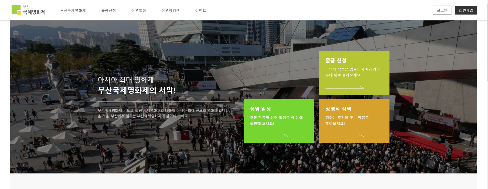
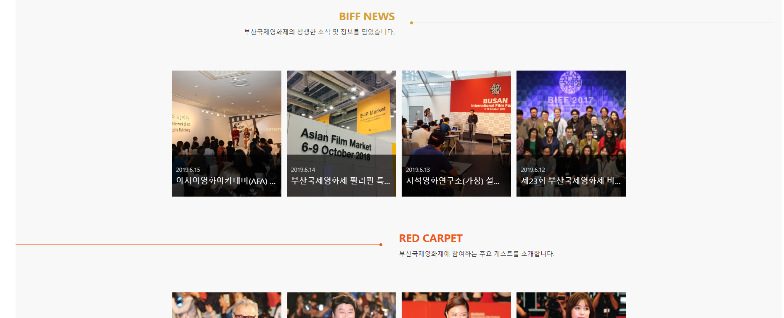
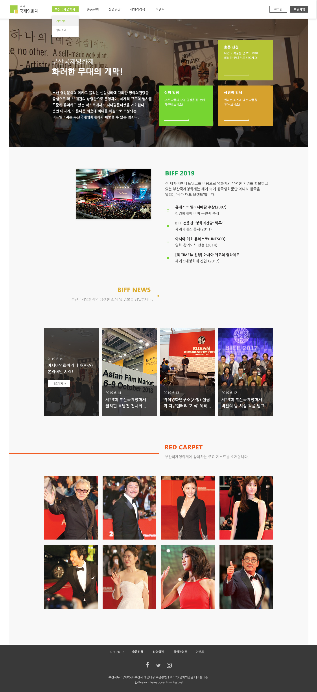
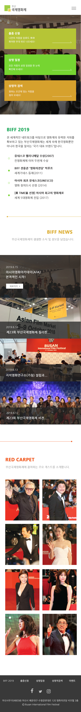
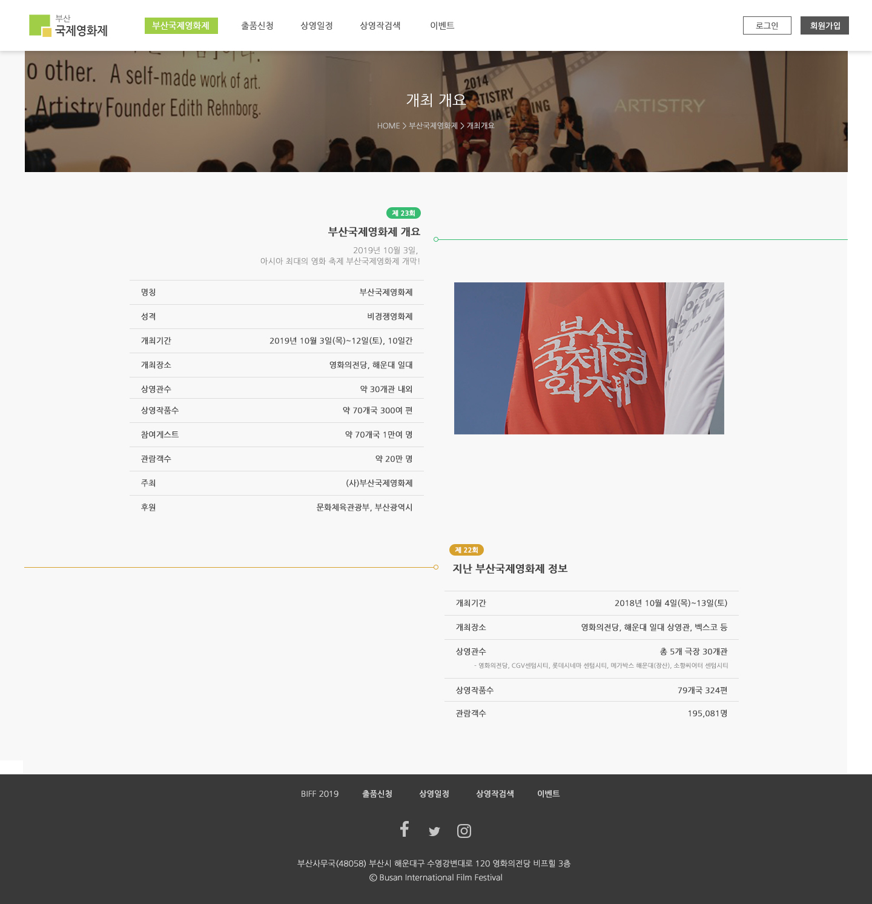
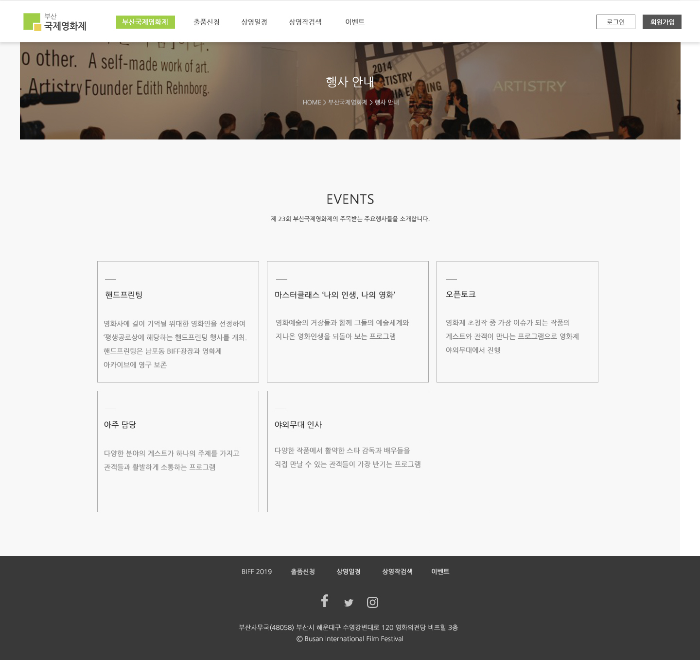

# 2019년 전국대회 과제 - 부산국제영화제

## 개요

이 프로젝트는 2020년 기능경기대회 준비를 목적으로 제작되었으며, 2019년 기능경기 전국대회 과제 문제를 베이스로 제작되었음을 알려드립니다. 과제 문제는 마이스터넷(https://meister.hrdkorea.or.kr/)에서 다운로드 받을 수 있습니다.

## 과제 설명

이번 과제 디자인은 지금까지와는 달리 비주얼 영역에 링크 영역을 크게 삽입하여 보았습니다. 빈 공간이 남지 않도록 영역을 가득 채우는 것을 좋아하기 때문에 개인적으로는 만족스럽습니다. 하지만, 과제 내용 중에 '슬라이드에 텍스트 요소를 포함해라' 라는 내용이 있기 때문에, 텍스트는 슬라이드와 함께 이동하지만, 링크 영역은 그대로인 것이 마음에 걸리네요. 과제에 맞게 디자인 템플릿을 변형하여 대처해야 할 것 같습니다.

**메인 비주얼 화면**

    

또한 이번 디자인에는 새롭게 구분선을 디자인해 보았습니다. 
새로운 도전이였지만, 나쁘지 않은 결과을 얻은 것 같아 좋습니다.
하지만, 좀 더 다듬어야 멋진 결과를 얻을 수 있을 거 같네요.

**구분선 디자인**

    

## 되돌아보기

A과제에서 중요한 요소들을 살펴봅시다.

* **시간은 최대한 빠르게** : A과제는 비교적 다른 과제보다 추가과제에서 시간을 잡아먹힐 확률이 적습니다. 따라서 최대한 빠르게 과제를 마치고 다른 과제를 먼저 코딩해 두는 것이 승리의 지름길이죠.

* **디자인은 돋보이게** : 심사위원이 한 대회에서 몇 명의 디자인을 평가할까요? 최소한 20명은 넘을겁니다. 따라서 최대한 내 디자인이 돋보이도록 다른 사람들과의 차별점을 두는 것이 중요할 겁니다.
* **여러 컴포넌트에 사용할 수 있게**: 디자인은 A과제에서 끝나지 않습니다. B, C과제에서도 새로운 페이지를 만들어 디자인하라고 할겁니다. 따라서 부트스트랩처럼 직접 스타일링을 하지 않고도 클래스만으로 디자인 할 수 있도록 구성하는 것이 좋습니다.

위 3가지 정도 있을 것 같네요. 사실, 3번째는 이 과제에서 거의 완벽하게 구성했다고 봐도 무방할 거 같은데…. 1번과 2번은 약간 애매하네요. 시간은 충족할 것 같지만, 디자인이 아직 독보적으로 눈에 띈다고 보긴 어려울 것 같습니다.

 역시 빠르게 모든 컴포넌트를 구성하다보면 아무래도 좀 디자인이 단순화되는 경향이 있네요. 제한시간은 4시간인데, 다른 과제까지 신경쓴다고 가정하면 3시간 안에 모든 페이지의 요구사항을 충족시키면서 예쁜 디자인까진 고려하려하기 위해서는 어느정도 디자인 템플릿을 구현해 둬야 할 것 같습니다. 

 예쁜 디자인을 하나 만들어두고 그 디자인만 반복연습해서 시간을 줄이는 거죠. 어느 주제가 나와도 무난하게 적용할 수 있을 정도로 괜찮은 템플릿을 구현해 둬야 겠네요.

## 페이지 미리보기

* [메인 페이지](#메인페이지)
* [메인 페이지 - 모바일](#메인페이지-모바일)
* [개최 개요 페이지](#개최개요)
* [행사 안내 페이지](#행사안내)

### 메인페이지

### 메인페이지-모바일

### 개최개요

### 행사안내

